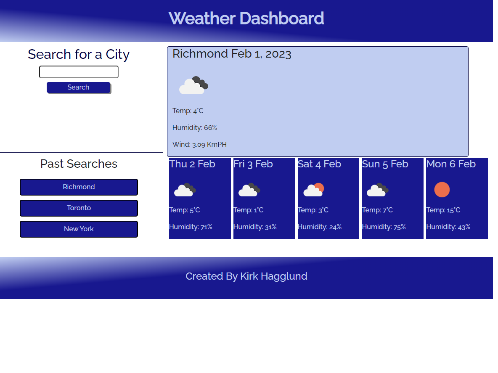

# Weather Forecast App

## Description

In this repository you will find code containing a dynamic weather forecast web application.

Using server side APIs, third party APIs, web APIs, JavaScript, CSS and HTML, I was able to dynamically display city weather reports and store the data in local storage for future reference.

## Usage

To utilize this app's features, simply enter a city name into the search field. You will be presented with a current weather analysis as well as the five day forecast below.

This information will also be simultaneously stored in the 'Past Searches' section for future reference. Each time you click on the city icon, it will refresh to current data and populate the weather field.

Website URL: http://kirkhagglund.github.io/weather-forecast-app/

'''md

'''

## Credits

Many thanks to the kind support team at Ask BCS who helped me get over the final hump of repopulating previous search data. 

I also took advantage of the following resources to both source and understand the deployment methods for the relevant information to this application.

Unix Timestamp Reference: https://www.coderrocketfuel.com/article/convert-a-unix-timestamp-to-a-date-in-vanilla-javascript

Open Weather API Resource: https://openweathermap.org/api

DayJS Library: https://day.js.org/en/

## License

MIT License Copyright (c) 2023 KirkHagglund